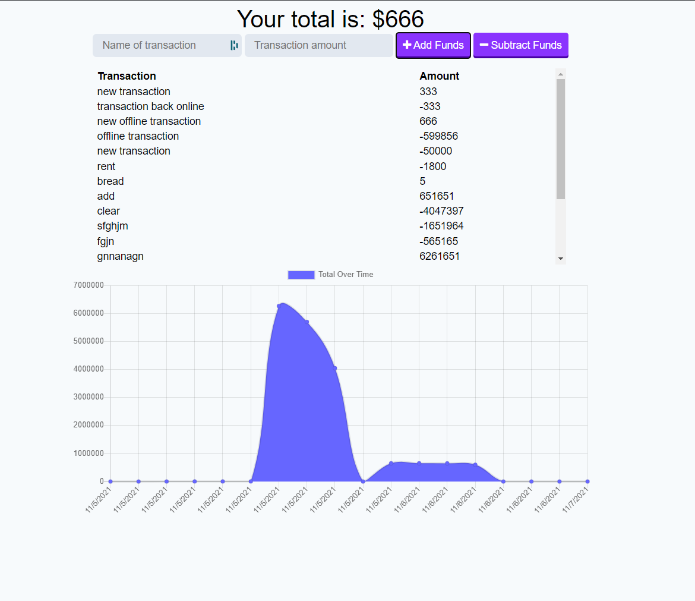

# homework-19-progressive-budget

-----------
# Description
This is a Progressive Web App that uses javascript to help a user keep track of their budget. Allows for simple budget tracking that works offline

-----------

## Operations
1. The app can be run locally by cloning the repository and setting up the localhost
    * clone repo
    * npm install
    * npm run seed
    * npm start
2. The app can also be accessed by navigating to https://radiant-cove-10172.herokuapp.com/

-----------
## Tech/Framework

* JavaScript
* NoSQL
* Express.js
* NPM: express, mongoose, morgan
* Node.js

-----------
## Authors and Acknowledgment
* Nick Skinner
* I'd like to thank the UC Davis coding bootcamp team for answering all my questions regarding this project.

-----------
## Known Errors
* heroku app does not display budget tracking properly. localhost displays correctly
* does not allow offline changes yet

-----------
## License
Copyright [2021] [##Authors]

Licensed under the Apache License, Version 2.0 (the "License");
you may not use this file except in compliance with the License.
You may obtain a copy of the License at

    http://www.apache.org/licenses/LICENSE-2.0

Unless required by applicable law or agreed to in writing, software
distributed under the License is distributed on an "AS IS" BASIS,
WITHOUT WARRANTIES OR CONDITIONS OF ANY KIND, either express or implied.
See the License for the specific language governing permissions and
limitations under the License.